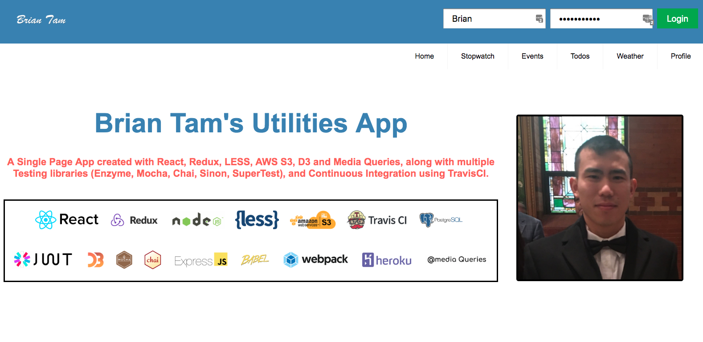
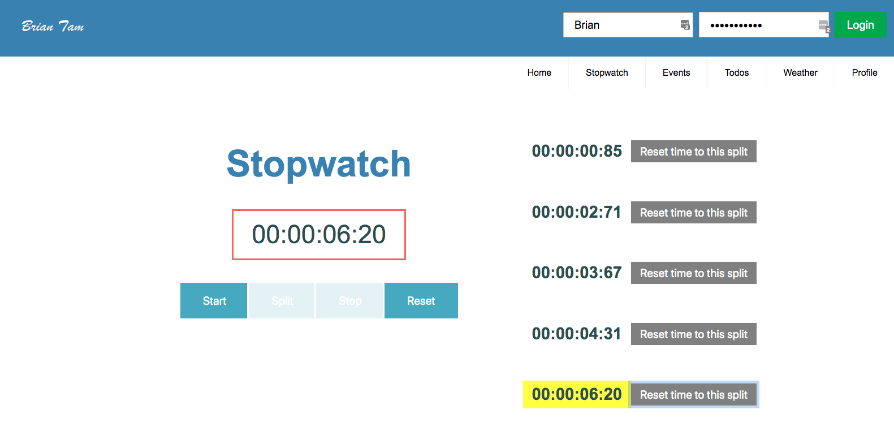
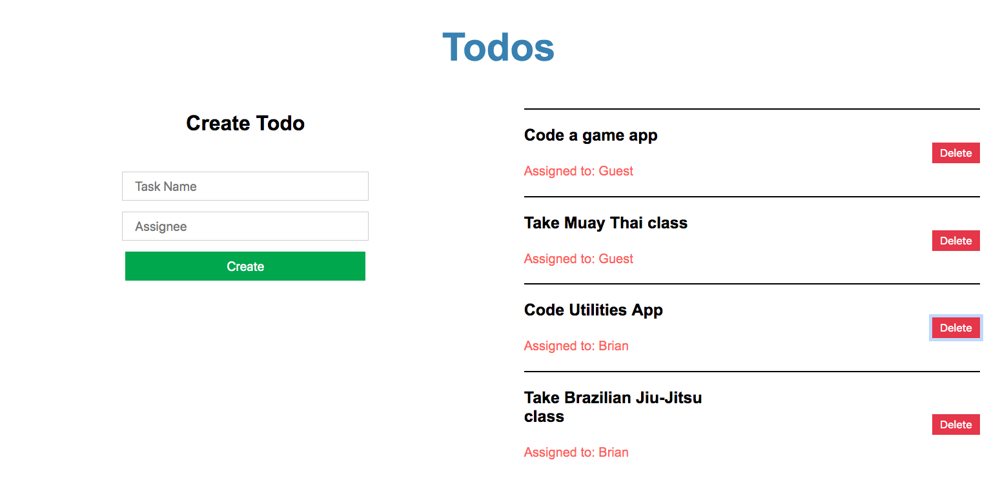

[](https://travis-ci.org/briantam23/utilities-app)
[](https://david-dm.org/briantam23/utilities-app)
[](https://david-dm.org/briantam23/utilities-app?type=dev)
[](https://codeclimate.com/github/briantam23/utilities-app/)

# ⏱ Utilities App

A Single Page App created with React, Redux, LESS, AWS S3, D3 and Media Queries, along with multiple Testing libraries (Enzyme, Mocha, Chai, Sinon, SuperTest), and Continuous Integration using TravisCI.

 <hr/>
 <hr/>
 <hr/>


## Table of contents
* [What is Amazon S3?](#what-is-amazon-s3?)
* [Login Credentials](#login-credentials)
* [Live Demo](#live-demo)
* [Dependencies](#dependencies)
* [Requirements](#requirements)
* [Installation](#installation)
* [Running Locally](#running-locally)
* [Deploying to Heroku](#deploying-to-heroku)
* [Tests](#tests)
* [Contact](#contact)

## What is Amazon S3?
Amazon Simple Storage Service is storage for the Internet. It is designed to make web-scale computing easier for developers.

Amazon S3 has a simple web services interface that you can use to store and retrieve any amount of data, at any time, from anywhere on the web. It gives any developer access to the same highly scalable, reliable, fast, inexpensive data storage infrastructure that Amazon uses to run its own global network of web sites. The service aims to maximize benefits of scale and to pass those benefits on to developers.

## Login Credentials

* Username: `Brian`  | Password: `Briantam23@`
* Username: `Mike`   | Password: `Mike12#`
* Username: `Johnny` | Password: `Johnny34&` 

## Live Demo

Currently deployed to [Heroku](https://btam-utilities-app.herokuapp.com)!

## Dependencies

* [React](https://reactjs.org)
* [Redux](https://redux.js.org)
* [LESS](http://lesscss.org)
* [AWS S3](https://aws.amazon.com/s3)
* [Enzyme](https://airbnb.io/enzyme)
* [PostgreSQL](https://www.postgresql.org)
* [D3](https://d3js.org)
* [Mocha](https://mochajs.org)
* [Express](https://expressjs.com)

## Requirements

* Downloads
    * [Node.js (v10.16.0)](https://nodejs.org/en/)
    * [Git](https://git-scm.com/downloads)
    * [PostgreSQL](https://www.postgresql.org/download/)
* Environment Variables (must be set in `.env` or set as an environment variable)
    * [`TICKETMASTER_API_KEY`](https://developer.ticketmaster.com/products-and-docs/apis/getting-started/)
    * [`S3_BUCKET`](https://docs.aws.amazon.com/AmazonS3/latest/dev/UsingBucket.html)
    * [`AWS_ACCESS_KEY_ID`](https://aws.amazon.com/premiumsupport/knowledge-center/create-access-key/)
    * [`AWS_SECRET_ACCESS_KEY`](https://aws.amazon.com/blogs/security/wheres-my-secret-access-key/)
    * [`OPEN_WEATHER_MAP_API_KEY`](https://openweathermap.org/appid)

## Installation

Step 1: Clone Repo
```sh
git clone https://github.com/briantam23/utilities-app.git` # or clone your own fork
```

Step 2: Create Database
```sh
createdb utilities-app
```

Step 3: Install `node_modules`
```sh
npm install # or yarn install
```

## Running Locally

```sh
npm run start:dev
```

The `npm run start:dev` command will run 2 processes:
* the `webpack` process (in watch mode) to build your client-side Javascript files
* the Node process for your server with `nodemon`

Your app should now be running on [localhost:8080](http://localhost:8080).

## Deploying to Heroku

Make sure you have the [Heroku CLI](https://devcenter.heroku.com/articles/heroku-cli) installed.

```
heroku create
git push heroku master
heroku open
```

Alternatively, you can deploy your own copy of the app using the web-based flow:

[](https://heroku.com/deploy)

## Tests

Created Tests for React Components, the Redux Store, Routes, Models, and Functions:

> To run without "watch mode": 
```sh
npm run test
``` 

> To run with "watch mode":
```sh
npm run test:dev
```

## Contact
Created by [Brian Tam](http://briantam23.github.io) - feel free to contact me at [briantam23@gmail.com](mailto:briantam23@gmail.com)!

Personal Website - [briantam23.github.io](http://briantam23.github.io) <br/>
LinkedIn - [@briantam23](https://linkedin.com/in/briantam23/) <br/>
Github - [@briantam23](https://github.com/briantam23)